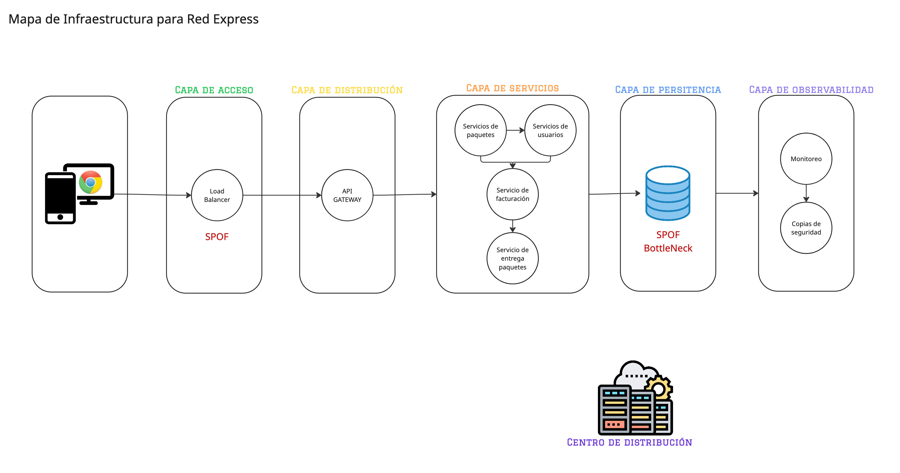

# Registro de Trabajo en Clase - Arquitectura C4

---
## Fecha de la sesión
13 de septiembre 2025

---
## Integrantes presentes

- Julián David Alvarado Gantiva
- Julián Camilo Durán Valencia
- Sebastián Piñeros Castellanos

---
## Actividades realizadas en clase

Se propuso el trabajo en clase del caso base para trabajarlo con el grupo de trabajo. Se definió por realizar un archivo en Miro con una plantilla predefinida para realizar el diagrama en conjunto y recibir feedback del archivo entre todos. El trabajo se logra realizar antes de la finalización de la clase.

---
## Boceto inicial del modelo

El boceto inicial es el subido en esta misma carpeta con el nombre. mapa_borrador.jph

Diagrama Arquitectura Empresarial Red Express - Final:

---

## Tareas definidas para complementar el taller

Se asignan las responsabilidades entre los miembros del equipo:

| Tarea asignada              | Responsable | Fecha estimada |
|-----------------------------|-------------|----------------|
| Modelado final en Miro   | Julián David Alvarado Gantiva   | 13/09          |
| Redacción del informe       | Julián Camilo Durán Valencia    | 13/09          |
| Investigación y referencias | Sebastián Piñeros Castellanos    | 10/09          |

---

Este documento resume el trabajo colaborativo realizado durante la sesión del taller Arquitectura - Infraestructura en el curso AREM - Universidad de La Sabana.
